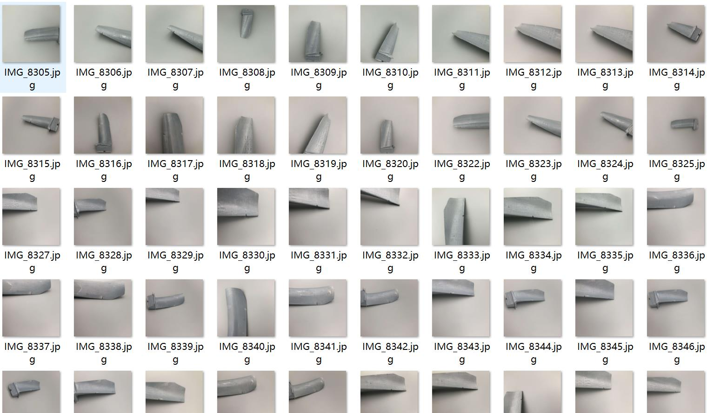
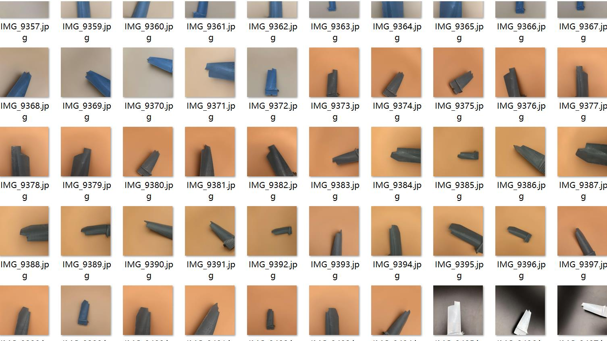
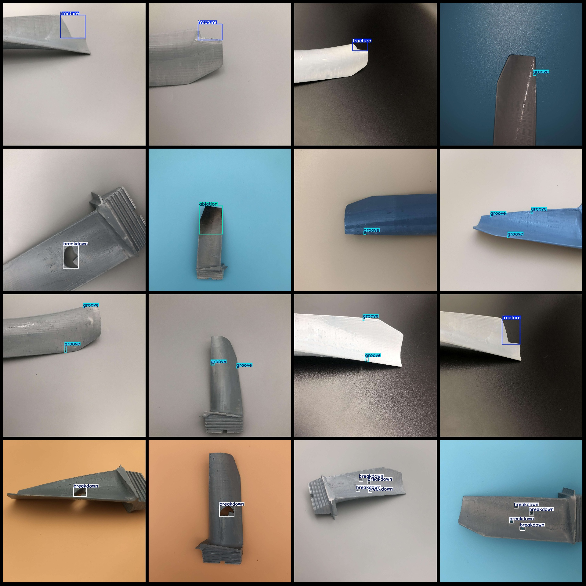
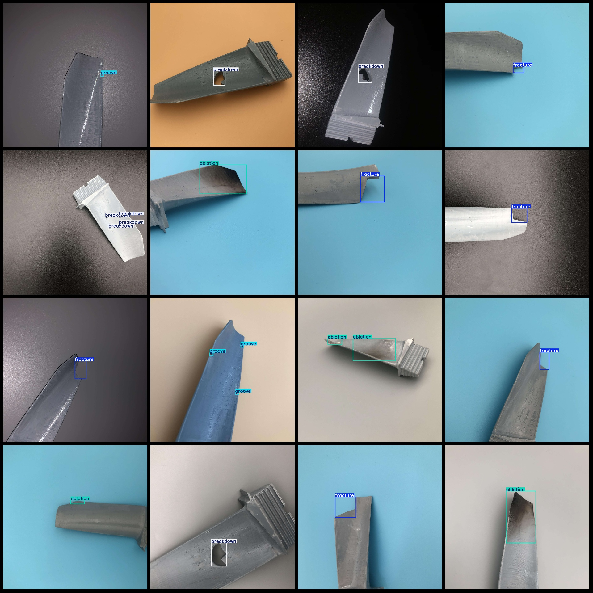

# AeBAD Aero Engine Blades Abnormality Detection Dataset VOC+YOLO Format, 1149 Images in 4 Classes

Dataset format: Pascal VOC format + YOLO format (txt file without split path, only containing jpg images and corresponding VOC format xml files and yolo format txt files)

Number of images (jpg file count): 1149
Number of annotations (xml file count): 1149
Number of annotations (txt file count): 1149
Number of annotation categories: 4
Annotation category names (note that the order of categories in the yolo format is not consistent with this, but is based on the labels folder's classes.txt): ["ablation", "breakdown", "fracture", 
"groove"]
Each category has the number of bounding boxes:
ablation (erosion) bounding box count = 279
breakdown (penetration/damage) bounding box count = 988
fracture (fracture) bounding box count = 389
groove (groove) bounding box count = 484
Total bounding box count: 2140
Image resolution: 1920x1920
Annotation tool used: labelImg
Annotation rule: draw rectangle bounding boxes for categories
Important note: The dataset does not have a training validation test split; it needs to be manually divided.
Special declaration: This dataset does not guarantee the accuracy of the trained models or weight files.
Image preview:
## Images

Here is a pay link on Stripe ( https://buy.stripe.com/3cs8yP7sY87d0vu9AB ). Please contact me lonlonago@foxmail.com after funding $89, and I will send you a complete data files , thank you!

